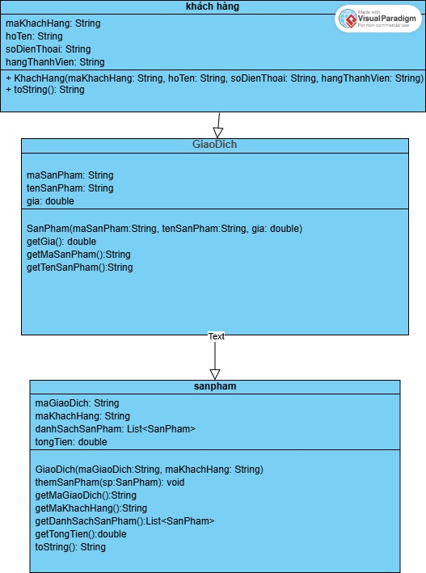

 <h1 align="center">Ứng Dụng Quản Lý Quán Coffee ☕ </h1>

  📚 <strong>Java OOP Project</strong> – Nhóm : <code>OOP_N05_T3_2025_HIEU_HAI</code>                                                  
  

# Đối tượng 

# Sơ đồ

Khách hàng
sản phẩn 
giao dịch 
Nhân viên (Nhân viên phục vụ / thu ngân) 

## 📖 Mô tả các đối tượng trong hệ thống

### 📌 1. **Khách hàng**
- 🆔 **Mã khách hàng** – định danh duy nhất cho từng khách
- 👤 **Họ tên** – tên đầy đủ của khách hàng
- 📞 **Số điện thoại** – liên lạc khi cần thiết
- 📧 **Email** – gửi thông tin khuyến mãi, hóa đơn
- 💎 **Hạng thành viên** – tích điểm và nhận ưu đãi

---

### 📌 2. **Sản phẩm**
- 🆔 **Mã sản phẩm** – định danh duy nhất cho sản phẩm
- 🥤 **Tên sản phẩm** – ví dụ: Cà phê sữa đá, Trà đào cam sả
- 🍵 **Loại** – phân loại (Cà phê, Trà, Sinh tố, ...)
- 💲 **Giá bán** – giá niêm yết cho khách
- 📝 **Mô tả** – thông tin chi tiết hoặc đặc biệt của món
- ⚡ **Trạng thái** – _Đang bán_ / _Ngừng bán_

---

### 📌 3. **Giao dịch**
- 🆔 **Mã giao dịch** – định danh cho từng hóa đơn
- 👤 **Mã khách hàng** – người thực hiện giao dịch
- 🛒 **Danh sách sản phẩm** – kèm số lượng từng món
- ⏰ **Thời gian giao dịch** – ngày, giờ thanh toán
- 💰 **Tổng tiền** – tổng giá trị hóa đơn

---

### 📌 4. **Nhân viên**
- 🆔 **Mã nhân viên** – định danh duy nhất
- 👤 **Họ tên** – tên đầy đủ nhân viên
- 🎯 **Chức vụ** – Phục vụ / Thu ngân / Quản lý
- 🕒 **Ca làm việc** – ca sáng, chiều, tối

---

## 🌟 **Thành viên dự án** 🌟

| 👤 Thành viên | 🎓 Mã sinh viên | 💻 GitHub |
|--------------|----------------|-----------|
| Nguyễn Văn Hiếu | 24100145 | [nguyenhieuzzz](https://github.com/nguyenhieuzzz) |
| Lê Quang Hải | 24100124 | [lequanghai-14](https://github.com/lequanghai-14) |

📩 **Liên hệ giảng viên:** Nguyễn Lệ Thu  
🏫 **Lớp:** OOP_N05 – Kỳ 3, Năm 2025
